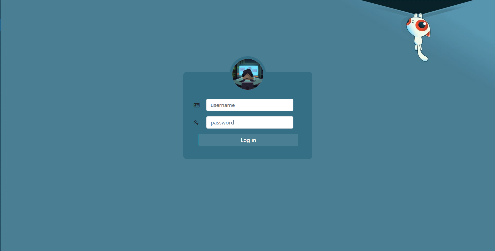
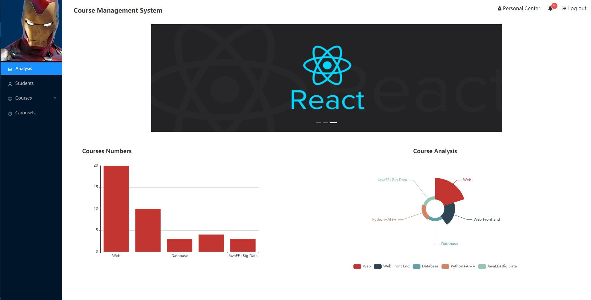
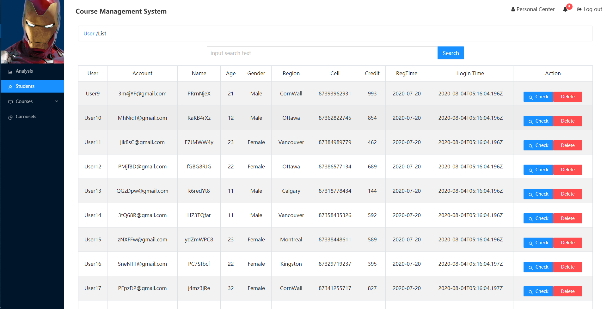
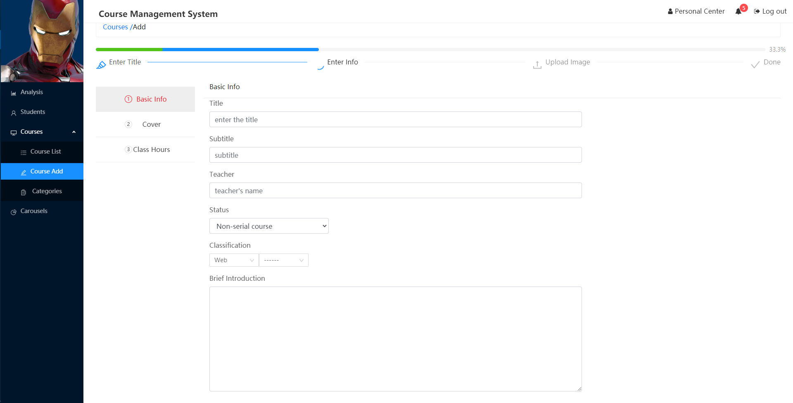
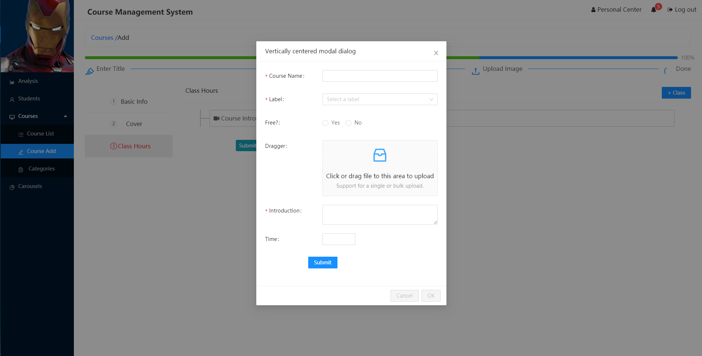
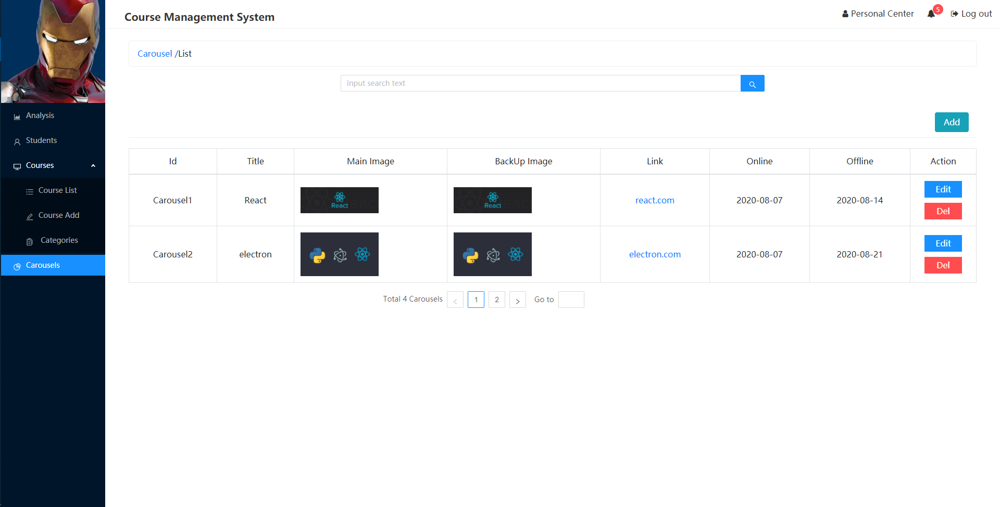

# Course Management System
**Preview Address:** [Click](fleetingsound.net)  (Id: <u>jake</u> , password: <u>123</u>)

Or

**Demo Video:** https://youtu.be/iBYSnz8xoUc

## Functions

1. Course release, modification and deletion, and comment on courses.
2. Control online and offline of the carousel diagram.
3. Browse and delete users.
4. Add, modify and delete course categories.
5. Use Echarts to show statistics about course categories.

## Stack

Front End:   React + Redux + Antd UI

Server:   Express + Mongoose

Database:   MongoDB

Deployment:  AWS + Nginx + Node + MongoDB 


## Installation

1. Server Install packages:

   ```js
   npm install 
   npm run dev
   ```

2. Front End  install packages:

   ```js
   npm install
   npm run start
   ```

3. Configure MongoDB information.(admin info and port)

To ensure correct operation, please run the backend service first, and then run the front end again, then visit http://localhost:3000


## Performance Optimization

- Compress`js`、`css`
- Using`gzip` 


## ScreenShots

**1 Login Page**



**2.Published Course**


**3.Home Page**




**4.User List** 



**5.Course Form**



**6.Course Form**




**7.Carousels Management**



